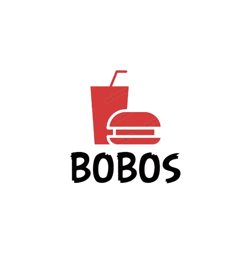

<h1 align="center">Virtual Store | 

</h1>

<b>Projeto avaliativo de Programação Web I | Cardápio Web</b>

## Descrição:

 Criado com o objetivo de simular um Cardápio Web, onde podemos fazer pedidos pela internet, nota-se que essa forma de compra teve destaque no período de pandemia e tornou-se uma das formas mais utilizadas de venda de produtos atualmente.
Para que o projeto fosse feito da melhor forma o Professor [Leonardo Santiago Sidon](https://github.com/LeonardoRochaMarista) passou as seguintes instruções:

>* Controle de versão com git/github.
>* Arquivo README documentado.
>* Um ou mais arquivos .html para os conteúdos.
>* Um ou mais arquivos .css para controlar o estilo das páginas.
>* Faça uma página com, no mínimo, 10 itens de venda.
>* Devem haver informações indispensáveis para a venda do alimento escolhido (foto, preço, quantidade, etc).

## Desenvolvedor 

|   <a href="https://github.com/ESChrystian">Chrystian Almeida Silva</a> |
| --- |
    
    

